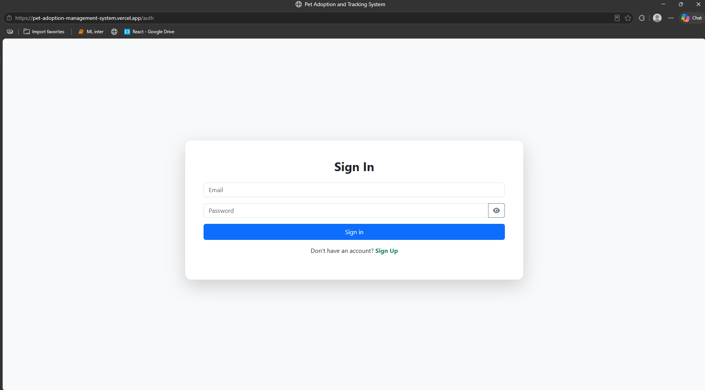
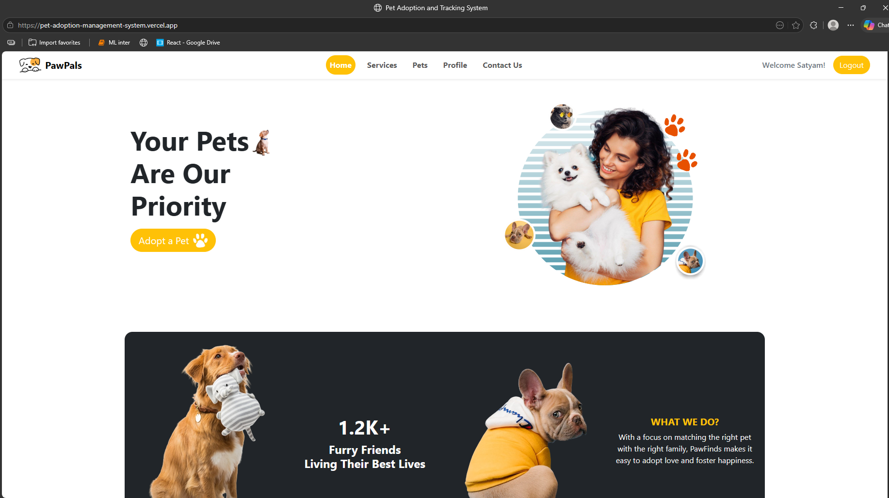
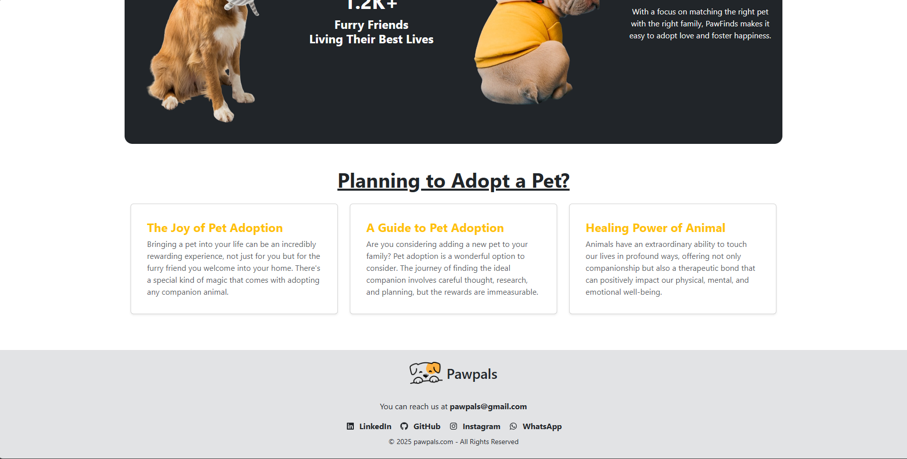
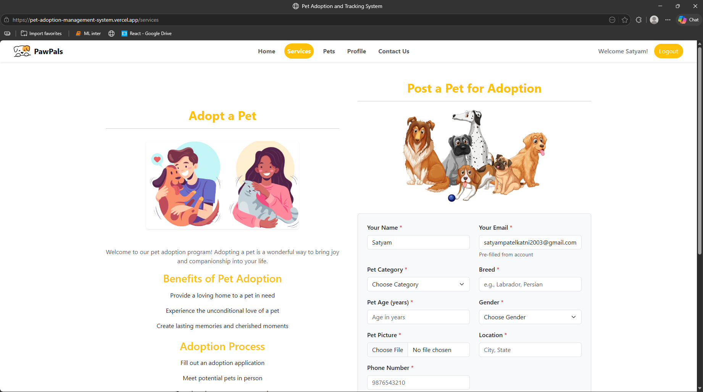
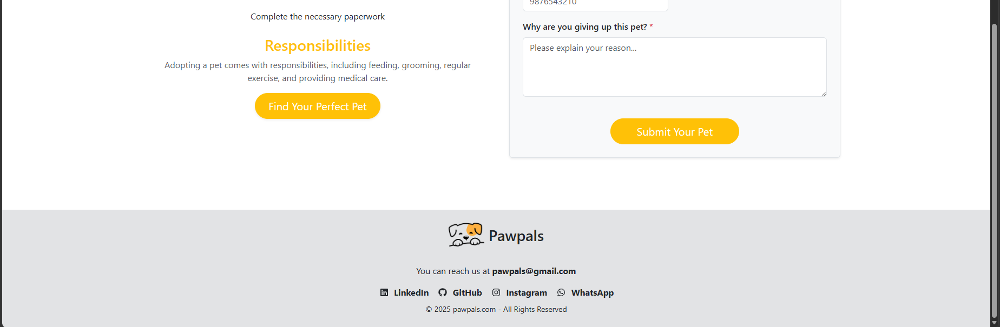
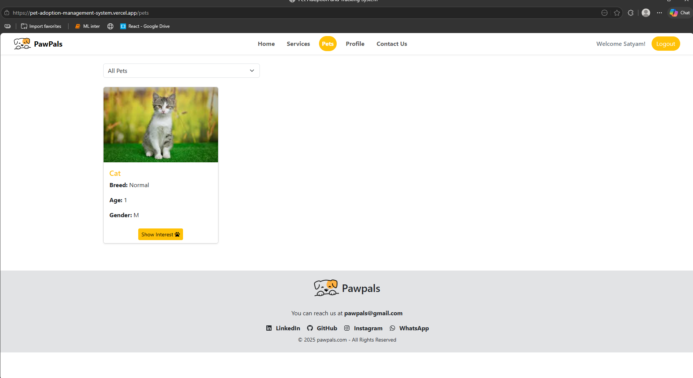
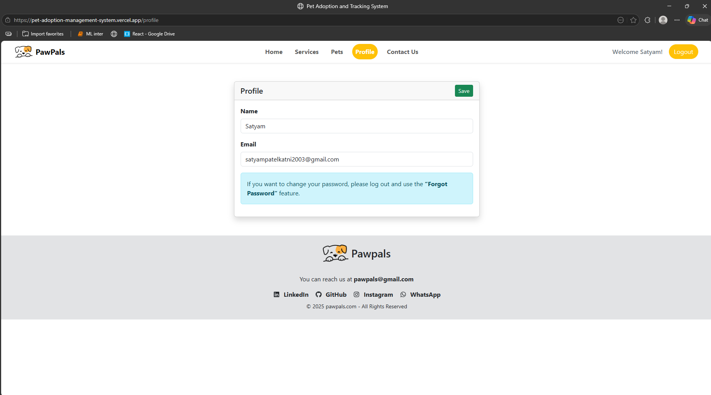
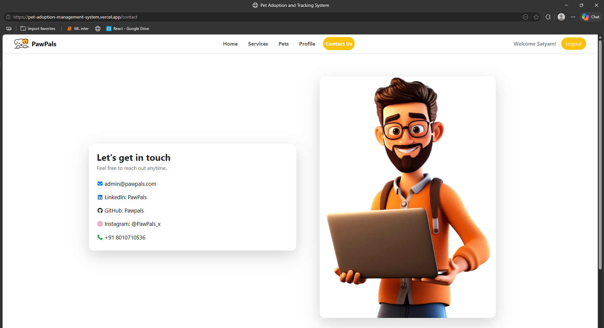
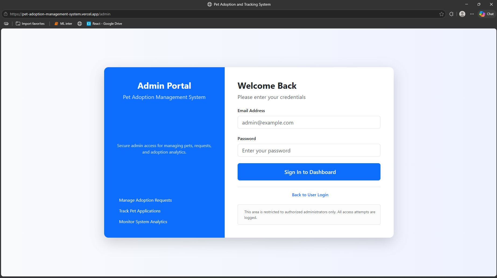

# 🐾 Pet Adoption & Tracking Management System

[](https://pet-adoption-management-system.vercel.app/)
[](LICENSE)

> A full-stack web application for managing pet adoptions with real-time tracking, built with React, Spring Boot, and MySQL.

---

## 📋 Table of Contents

- [Overview](#-overview)
- [Features](#-features)
- [Technology Stack](#-technology-stack)
- [Database Schema](#-database-schema)
- [Screenshots](#-screenshots)
- [Installation](#-installation)
- [API Documentation](#-api-documentation)
- [Future Enhancements](#-future-enhancements)
- [Contact](#-contact)

---

## 🎯 Overview

The **Pet Adoption & Tracking Management System** is a comprehensive platform that connects pet owners, adopters, and administrators to facilitate responsible pet adoption. The system features role-based access control, real-time tracking of adopted pets, and an intuitive admin dashboard for managing the entire adoption lifecycle.

### 🌟 Key Highlights

- **Multi-User Platform**: Separate interfaces for regular users and administrators
- **Real-Time Tracking**: Post-adoption health monitoring and location tracking
- **Secure Authentication**: JWT-based authentication with bcrypt password hashing
- **Responsive Design**: Mobile-first approach using Bootstrap 5
- **RESTful API**: Well-structured backend with comprehensive endpoints
- **Database Optimization**: Normalized schema with foreign key relationships and triggers

---

## ✨ Features

### 👤 User Features

- **User Registration & Login**
  - OTP-based email verification
  - Secure password hashing with bcrypt
  - Session management with JWT tokens

- **Browse Available Pets**
  - Filter by category (dogs, cats, birds, fish, rabbits)
  - View detailed pet information (breed, age, gender, health status)
  - High-quality pet images

- **Submit Adoption Requests**
  - Fill detailed adoption application form
  - Provide living situation details
  - Share previous pet experience
  - Track application status (Pending/Approved/Rejected)

- **Post Pets for Adoption**
  - Users can list their own pets for adoption
  - Upload pet images and details
  - Admin approval workflow

### 👨‍💼 Admin Features

- **Dashboard Analytics**
  - Total users, pets, and adoption statistics
  - Monthly adoption trends
  - Pet category distribution charts
  - Recent activity feed

- **Pet Management**
  - Approve/reject user-submitted pets
  - Add, edit, delete pets from the system
  - Manage pet availability status

- **Adoption Request Management**
  - View all pending adoption requests
  - Review applicant details and suitability
  - Approve/reject adoption applications
  - Automated pet status updates via triggers

- **Post-Adoption Tracking**
  - Monitor adopted pet locations
  - Record veterinary visit dates
  - Track vaccination status
  - Add health notes and updates
  - Complete tracking history per pet

---

## 🛠️ Technology Stack

### Frontend

| Technology | Purpose |
|------------|---------|
| **React.js 18** | UI framework for building component-based interface |
| **React Router DOM** | Client-side routing and navigation |
| **Bootstrap 5** | Responsive CSS framework |
| **Bootstrap Icons** | Icon library |
| **date-fns** | Date formatting and manipulation |
| **Vite** | Fast build tool and dev server |

### Backend

| Technology | Purpose |
|------------|---------|
| **Spring Boot 3.x** | Java-based backend framework |
| **Spring Security** | Authentication and authorization |
| **Spring Data JPA** | Database ORM and data access |
| **Hibernate** | JPA implementation |
| **MySQL 8.x** | Relational database |
| **JWT (JSON Web Tokens)** | Stateless authentication |
| **BCrypt** | Password hashing algorithm |
| **JavaMailSender** | Email service for OTP verification |

### Tools & Services

- **Maven** - Dependency management and build automation
- **Git & GitHub** - Version control
- **Vercel** - Frontend deployment
- **MySQL Workbench** - Database design and management

---

## 🗄️ Database Schema

### Key Tables

#### `users` Table
Stores user account information with role-based access.

#### `pet` Table
Main pets table for approved pets available for adoption.

#### `pets_pending` Table
User-submitted pets awaiting admin approval.

#### `adoption_requests` Table
- Uses **foreign keys** (user_id, pet_id) instead of duplicate data
- Normalized design prevents data redundancy
- Automatic status updates via database triggers

#### `tracking` Table
Post-adoption monitoring records (location, vet visits, vaccinations).

### Database Triggers

**`trg_update_pet_status_after_request`**
- Automatically updates pet status when adoption request changes
- APPROVED → pet status = `adopted`
- REJECTED → pet status = `available`
- PENDING → pet status = `pending`

---

## 📸 Screenshots

### Authentication

#### Login Page

*Sign in page*

### User Interface

#### Home Page

*Your Pets Are Our Priority - Landing page*

#### Browse / Features

*Planning to Adopt a Pet section*

#### Adopt Page

*Adoption listing page*

#### User Dashboard

*User dashboard overview*

#### Pet Details

*Individual pet details page*

#### Adoption Form

*Adoption application form*

#### Contact Page

*Get in touch page*

### Admin Interface

#### Admin Dashboard

*Analytics and system overview*

#### Admin Panel

*Admin portal and welcome screen*

---

## 🚀 Installation

### Prerequisites

- **Node.js** 18.x or higher
- **Java JDK** 17 or higher
- **MySQL** 8.x
- **Maven** 3.8+
- **Git**

### 1️⃣ Clone the Repository

```bash
git clone https://github.com/Satyam123Patel/pet-adoption-system.git
cd pet-adoption-system
```

### 2️⃣ Database Setup

```bash
# Login to MySQL
mysql -u root -p

# Create database and import schema
source database/schema.sql

# Insert sample data
source database/data.sql
```

**Default Admin Credentials:**
- Email: `admin@petadoption.com`
- Password: `admin123`

### 3️⃣ Backend Setup

```bash
cd backend

# Edit src/main/resources/application.properties
spring.datasource.url=jdbc:mysql://localhost:3306/pet_adoption_system
spring.datasource.username=YOUR_DB_USERNAME
spring.datasource.password=YOUR_DB_PASSWORD

spring.mail.username=YOUR_EMAIL
spring.mail.password=YOUR_APP_PASSWORD

# Build and run
mvn clean install
mvn spring-boot:run
```

**Backend runs on:** `http://localhost:8080`

### 4️⃣ Frontend Setup

```bash
cd frontend

npm install

# Edit .env file
VITE_API_URL=http://localhost:8080

npm run dev
```

**Frontend runs on:** `http://localhost:5173`

---

## 📡 API Documentation

### Authentication Endpoints

| Method | Endpoint | Description |
|--------|----------|-------------|
| POST | `/api/auth/signup` | User registration with OTP |
| POST | `/api/auth/verify-otp` | Verify OTP code |
| POST | `/api/auth/login` | User login |
| POST | `/api/auth/admin/login` | Admin login |

### Pet Endpoints

| Method | Endpoint | Description |
|--------|----------|-------------|
| GET | `/pets` | Get all available pets |
| GET | `/pets/{id}` | Get pet by ID |
| POST | `/pets/post-pet` | Submit pet for adoption |
| GET | `/api/admin/pets/pending` | Get pending submissions |
| POST | `/api/admin/pets/approve/{id}` | Approve pet |

### Adoption Endpoints

| Method | Endpoint | Description |
|--------|----------|-------------|
| POST | `/adoptions/{petId}` | Submit adoption request |
| GET | `/adoptions/user/{email}` | Get user's requests |
| GET | `/api/admin/adoptions/pending` | Get pending requests |
| PUT | `/api/admin/adoptions/{id}/approve` | Approve request |
| PUT | `/api/admin/adoptions/{id}/reject` | Reject request |

### Tracking Endpoints

| Method | Endpoint | Description |
|--------|----------|-------------|
| GET | `/api/admin/tracking/adopted-pets` | Get adopted pets |
| GET | `/api/admin/tracking/pet/{petId}` | Get tracking records |
| POST | `/api/admin/tracking/add` | Add tracking record |
| DELETE | `/api/admin/tracking/delete/{id}` | Delete record |

---

## 🔮 Future Enhancements

- [ ] **Payment Integration**: Stripe/Razorpay for adoption fees
- [ ] **Chat System**: Real-time messaging between users and admins
- [ ] **Pet Matching Algorithm**: AI-based pet recommendations
- [ ] **Mobile App**: React Native version
- [ ] **Notifications**: Push notifications for request updates
- [ ] **Dark Mode**: Theme switching

---

## 👨‍💻 Developer

**Satyam Patel**

- GitHub: [@Satyam123Patel](https://github.com/Satyam123Patel)
- Email: satyampatelkatni2003@gmail.com

---

## 📄 License

This project is licensed under the MIT License - see the [LICENSE](LICENSE) file for details.

---

<div align="center">

### ⭐ Star this repository if you found it helpful!

Made with ❤️ for pets and their future families

</div>
